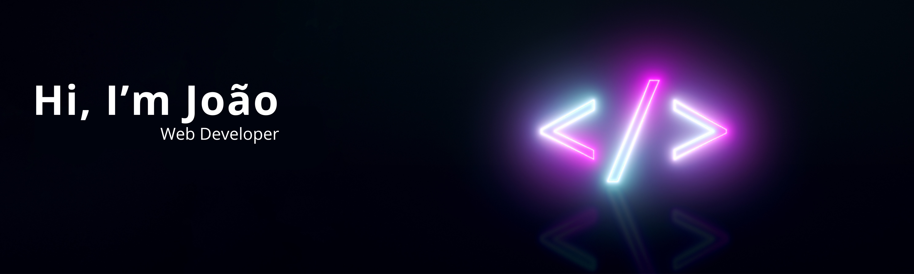

<!--  -->

 

## My Stack

## About me

-  Hello! My name is João Santana and I am a FullStack Developer.  
-  My current goal is to become a senior and, in the future, become a Tech Lead. 
-  My main stack is HTML, CSS, Javascript, Typescript, React, NextJS, TailwindCSS, NodeJs and Styled-components. 
-  I always try to be a polite and respectful person, and I love interacting with new people and sharing my story. 
-  Want to talk about technology, games or sports? Send a message!

 

## Contact me

